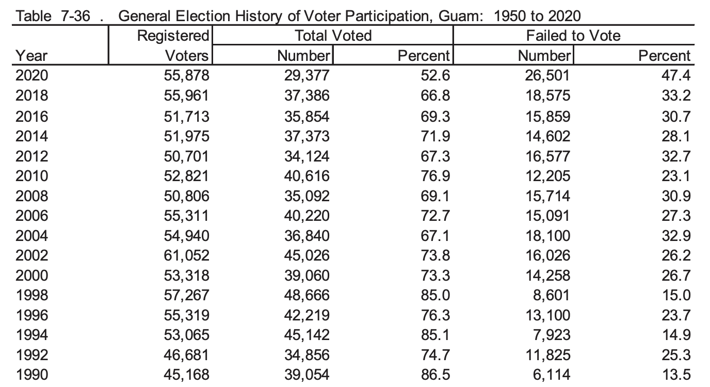

# Conditionals & Loops

### If-else statement

```{r eval=FALSE, include = TRUE}
# simple if else
if (condition) {
  do if TRUE
} else {
  do if FALSE
}

# extension of if else
if (condition) {
  do something
} else if (condition2) {
  do something 
} else {
  do this instead
}

```

### Defining a Function

```{r eval = FALSE, include = TRUE}
#'
#' purpose of this function
#'
#' @param arg1 define arg1
#' @param arg2 define arg2
#'
#' @return description 
function_name <- function(arg1, arg2, ...) {
  write code here
  
  return(returned_object)
}

```

### Creating a for loop

```{r eval = FALSE, include = TRUE}
for (loopindex in vector) {
  do this
}

```

### Case Study

We'll start with analyzing registered voter data in Guam from 1990 to 2020 (taken from the Guam Statistical Yearbook).

{width="470"}

```{r}
year <- seq(from = 2020, to = 1990, by = -2)
failed_to_vote <- c(47.4, 33.2, 30.7,28.1, 32.7, 23.1,
                     30.9, 27.3,  32.9, 26.2, 26.7,15.0, 23.7, 14.9, 25.3,13.5)

names(failed_to_vote) <- year
```

From 1990-2020, the mean percent of failure to vote:

```{r}
mean(failed_to_vote)
```

Let's say that if a year has a percent \> 25%, then let's define that as "poor turnout", if a year has \< 25% of failure to vote, then that will be defined as "decent turnout"

We will define a function for this

```{r}
#'
#' determine if year has "poor voter turnout" or "decent voter turnout"
#'
#' @param percent numeric percent of failure to vote 
#' 
#' @return string of either "poor" or "decent"
determine_outcome <- function(percent) {
  outcome <- ""
  if (percent >= 25) {
    outcome <- "poor"
  } else {
    outcome <- "decent"
  }
  return (outcome)
}
```

Test the function with any value - 4 should return "decent" and 25 should return "poor".

```{r}
print(determine_outcome(4))
print(determine_outcome(25))
```

Now, let's define a For-Loop to use this function over the elements in `failed_to_vote` vector.

```{r}
# option 1 for a for loop
for (percent in failed_to_vote) {
  print(percent)
  print(determine_outcome(percent))
}

# option 2 - index with value
for (i in 1:length(failed_to_vote)) {
  print(failed_to_vote[i])
  print(determine_outcome(failed_to_vote[i]))
}

# save these outcomes
outcome <- c()
for (percent in failed_to_vote) {
  outcome <- append(outcome, determine_outcome(percent))
}
```

## Lists vs Vectors

A *vector* is a one dimensional array of elements. Almost all data in R is stored in a vector. A *list* is a *recursive vector,* meaning a list can contain vectors that contain vectors or other lists. Lists can contain lists of vectors or lists of data.frames.

### apply(), lapply() family

The best way to loop through the vector and categorize each outcome is with an implicit loop. `lapply` takes in a vector, a list, or a Dataframe as input and always returns a list. The specified function is applied to each element of the input object.

```{r}
outcomes <- lapply(failed_to_vote, determine_outcome)
# since the output is always a list we can break it up back into a vector
outcomes <- unlist(outcomes)
```

From the same table, let's grab the total percent voted column.

```{r}
total_voted <- c(52.6, 66.8, 69.3, 71.9, 67.3, 76.9, 69.1, 72.7, 67.1, 73.8, 73.3, 85.0, 76.3, 85.1, 74.7, 86.5)
names(total_voted) <- year
```

We can add both the `total_voted` and `failed_to_vote` vector to a list with the `list` function.

```{r}
vote_percent <- list(total_voted, failed_to_vote)
```

Use functions to apply to each vector:

```{r}
print(lapply(vote_percent, mean))
print(lapply(vote_percent, summary))
```

If you try using, `lapply`() with the function `determine_outcome`, you will result in an error due to the set-up of the function. The error appears since `determine_outcome` expects a single numeric value as input, but we are passing a vector of values into an if statement. In addition, An **if()** statement can only check one element in a vector at one time, but using this code we attempted to check every element in the vector at once.

```{r}
# let's fix this by re-defining the function

#'
#' determine if value indicates "poor turnout" (>=25) or "decent turnout" (<25)
#'
#' @param percent numeric value that indicates percent of failure to vote
#'
#' @return string of either poor or decent
determine_outcome <- function(percent) {
  ifelse(percent >=25, "poor", "decent")
}
```

The `ifelse` function allows you to perform element-wise conditions on vectors or data frames. (This allows vectors while the traditional if..else does not).

In our `failed_to_vote` vector, how many times do we have poor outcomes and how many times do we have decent outcomes?

```{r}
# define a loop to count this
# count how many times decent or poor appear
decent_val <- 0
poor_val   <- 0

for (percent in failed_to_vote) {
  if (determine_outcome(percent) == "poor") {
    poor_val <- poor_val + 1
  }
  else if (determine_outcome(percent) == "decent") {
    decent_val <- decent_val + 1
  }
}
```

Above is a very crude example, and for this specified purpose, I would just use:

```{r}
table(outcomes)
```

However, this is a basic example demonstrating how to use a for-loop to increment variables.
